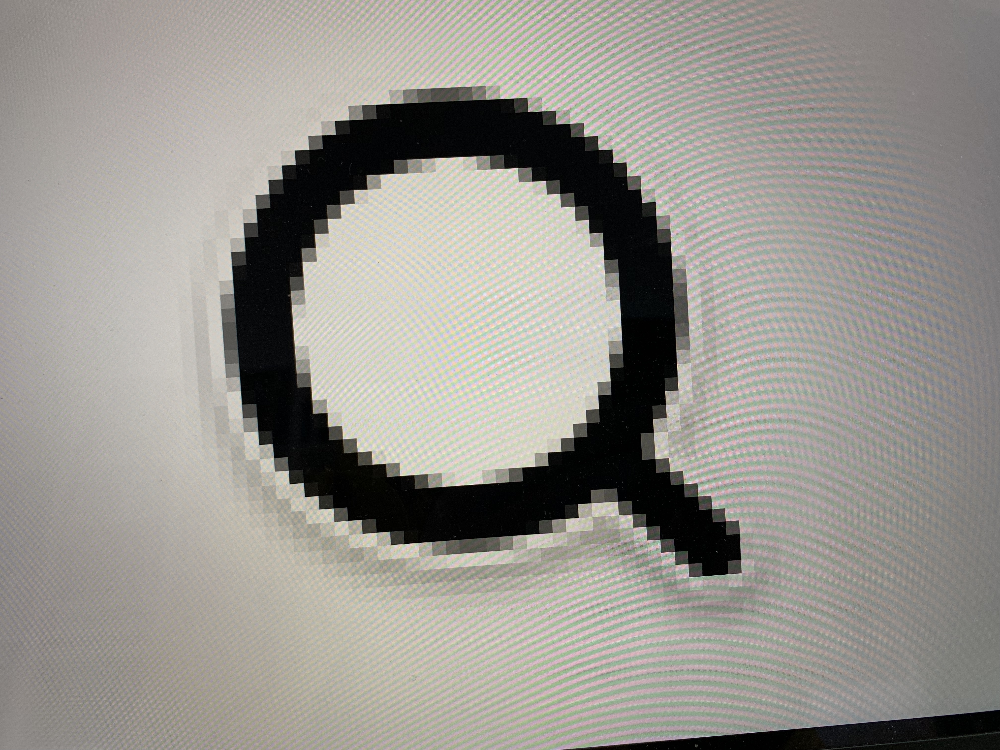

# Safari CSS cursor bug

## Issue description

When setting a custom CSS cursor in Safari, the image rendered look blurry on scaled screen resolutions.

These are two photos of a MacBook Pro 13" M1 running macOS Ventura 13.2, on Safari Version 16.3 (18614.4.6.1.5).

Scaled screen ("Default" in System Settings):

Native resolution (2560 x 1600, enabled with [Display Menu](http://displaymenu.milchimgemuesefach.de/index.html)):

The code used for those images is on [index.html](index.html), and you can see it online at [https://bomberstudios.github.io/safari-css-cursor-bug/](https://bomberstudios.github.io/safari-css-cursor-bug/).

## Notes

The bug happens with both SVG and PNG files. It affects both the built-in screen, and external monitors.
